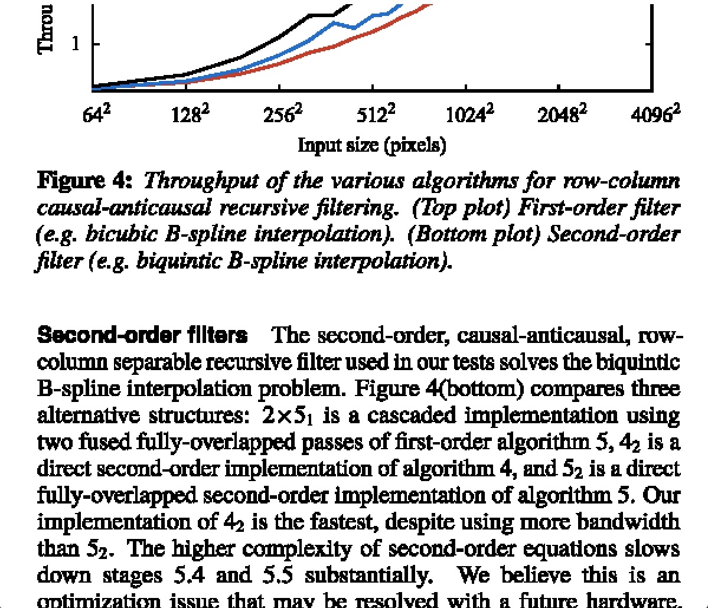

# VkScanlinePR

## Intro

The project refer to a paper which is *[Efficient GPU Path Rendering Using Scanline Rasterization (ACM Transactions on Graphics (SIGGRAPH Asia) 2016)](http://kunzhou.net/zjugaps/pathrendering/)*. The purpose of the project is to achieve scanline-based path rendering and comb-like multisampling (TODO) by **Vulkan API**. And the  parallel-algorithm part of implement of original project is by CUDA. Therefore, I achieve it by **Computer Shader**.

## Build

**Windows**：

First, you should install **Visiual Studio 2019 (MSVC v142)** and **Windows 10 SDK**. The vulkan installation is **required**. Because the project need to load some vulkan DLL file such as `shaderc_shared.dll` and you may need to use some tools. For example, if you modify a compute shader, you will use `glslc` to compile the modified shader and input command "`glslc xxx.comp -o spv/xxx.spv`". Luckily, a script is provided which is `workdir/shaders/shader_compile.py`. You can run the script to compile all shaders. You no longer have to manually input commands to compile the specified shaders.


**Linux**：

- Run `git submodule init` then `git submodule update`

- Install [vulkan-icd-loader](https://archlinux.org/packages/?name=vulkan-icd-loader)

  ```sh
  pacman -S vulkan-icd-loader
  ```

- Verification：`ls /usr/share/vulkan/icd.d/` or `vulkaninfo`

- Build：`BUILD_TARGET=a.out ./script/build.sh -j[N]` (N is your cpu core number)

- Run：`cd workdir && ../build/bin/a.out`


## Dependencies

- glfw-3.3.5
- glm-0.9.9.8
- vulkan-1.2.189.2

## Example

### paper-1

